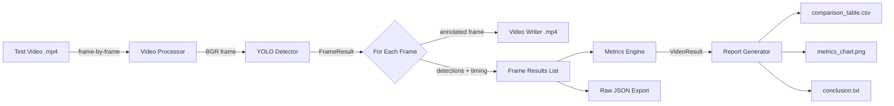
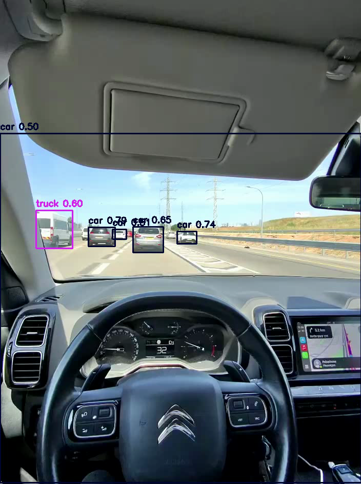
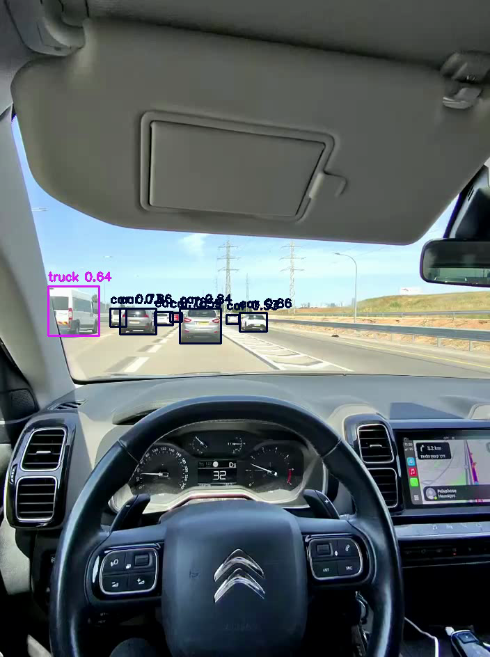
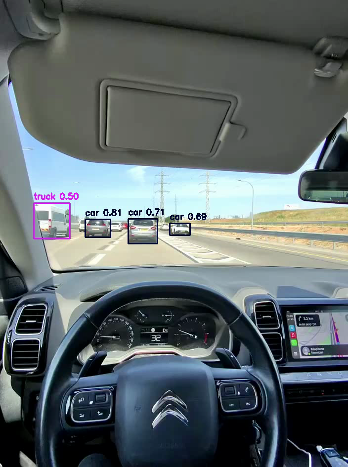
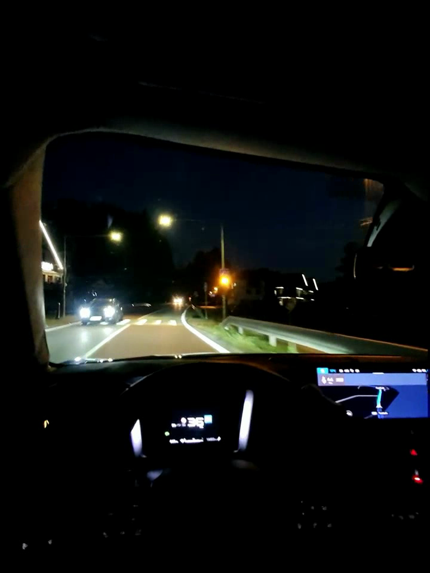
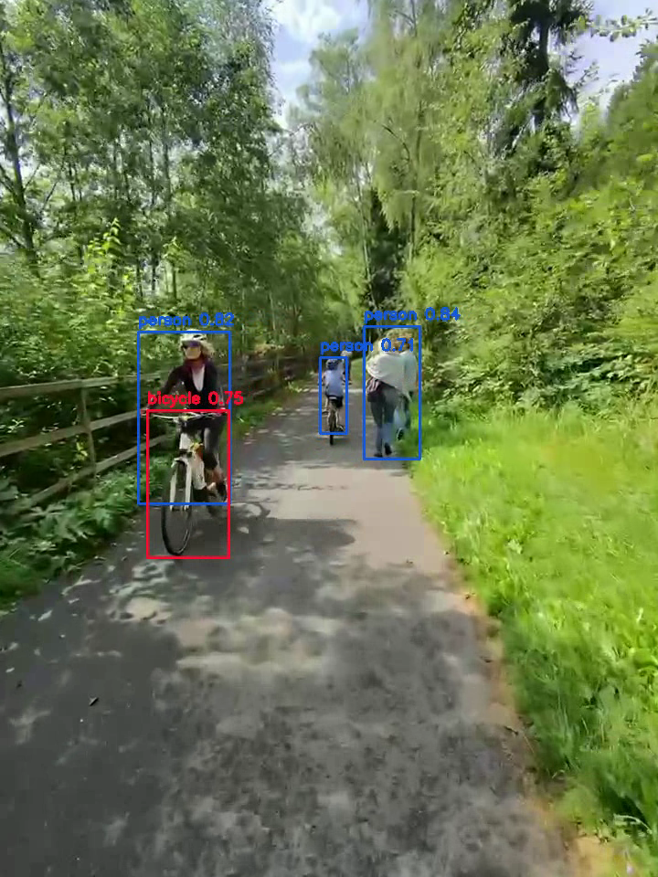
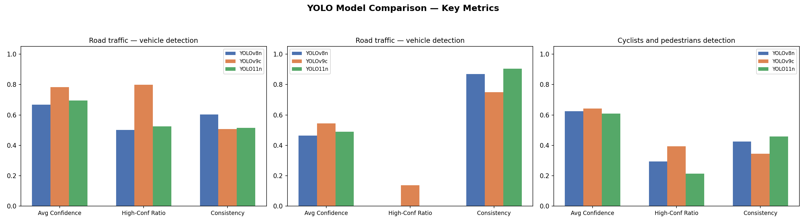

# YOLO Video Object Detection Comparison

> 📚 **Course Assignment** — This project was developed as a learning home assignment for the **AI Development** course.

A Python project comparing three YOLO model versions — **YOLOv8n**, **YOLOv9c**, and **YOLO11n** — on video object detection tasks. The pipeline processes every frame of each test video, computes eight evaluation metrics, and produces a comparative report with charts and a written conclusion.

---

## Table of Contents

1. [Project Structure](#project-structure)
2. [Data Flow](#data-flow)
3. [Setup](#setup)
4. [Usage](#usage)
5. [How It Works](#how-it-works)
6. [Test Videos](#test-videos)
7. [Evaluation Metrics](#evaluation-metrics)
8. [Detection Examples](#detection-examples)
9. [Results](#results)
10. [Conclusion](#conclusion)

---

## Project Structure

```
yolo_comparison/
├── main.py                     # Entry point — orchestrates the pipeline
├── config.py                   # Central config: models, videos, thresholds
├── utils.py                    # Utility functions (JSON export)
├── video_processor.py          # Frame-by-frame generator & video writer
│
├── models/                     # YOLO weight files (auto-downloaded, git-ignored)
│   ├── yolov8n.pt
│   ├── yolov9c.pt
│   └── yolo11n.pt
│
├── detectors/
│   ├── __init__.py             # Exports all detector classes
│   ├── base_detector.py        # ABC + FrameResult/VideoResult dataclasses
│   ├── yolov8_detector.py      # YOLOv8-nano detector
│   ├── yolov9_detector.py      # YOLOv9-compact detector
│   └── yolo11_detector.py      # YOLO11-nano detector
│
├── evaluation/
│   ├── __init__.py             # Exports report generator
│   ├── metrics.py              # Aggregated metric computation
│   ├── report.py               # Orchestrates table + chart + conclusion
│   ├── table.py                # Comparison table (tabulate + CSV)
│   ├── chart.py                # Grouped bar chart (matplotlib)
│   └── conclusion.py           # Auto-generated written conclusion
│
├── test_files/                 # Test video files (user-provided)
│   ├── test1.mp4
│   ├── test2.mp4
│   └── test3.mp4
│
├── results/                    # Generated at runtime
│   ├── annotated/              # Annotated .mp4 videos with bounding boxes
│   ├── raw/                    # Per-frame detection data (JSON)
│   ├── comparison_table.csv
│   ├── metrics_chart.png
│   └── conclusion.txt
│
├── requirements.txt
└── README.md
```

---

## Data Flow

The pipeline follows this sequence for each **(model × video)** combination:



**Key design decisions:**
- **Streaming processing** — frames are read, detected, and written one at a time. The annotated frame is discarded immediately after writing, keeping memory usage low regardless of video length.
- **Uniform interface** — all three detectors share a common `BaseDetector` ABC, so adding a new YOLO version requires only a new file with the same pattern.

---

## Setup

### 1. Create a virtual environment

```bash
python -m venv venv
source venv/bin/activate   # macOS / Linux
```

### 2. Install dependencies

```bash
pip install -r requirements.txt
```

Installs: `ultralytics`, `opencv-python`, `numpy`, `pandas`, `tabulate`, `matplotlib`.

### 3. Place test videos

Copy three `.mp4` files into `test_files/`:

```
test_files/
├── test1.mp4   ← road/traffic video
├── test2.mp4   ← road/traffic video
└── test3.mp4   ← cyclists/pedestrians video
```

Model weights download **automatically** into `models/` on first run.

---

## Usage

```bash
python main.py
```

The script processes every frame of every video with every model (9 total runs), then generates the full evaluation report.

---

## How It Works

### Step 1 — Configuration (`config.py`)

All settings are centralised:

| Parameter | Value | Purpose |
|---|---|---|
| `CONFIDENCE_THRESHOLD` | `0.4` | Minimum detection confidence |
| `MODELS` | YOLOv8n, YOLOv9c, YOLO11n | Models to compare |
| `TEST_FILES` | test1, test2, test3 | Videos with task-specific target classes |

### Step 2 — Frame-by-Frame Detection

For each **(model × video)** pair:

1. `video_processor.iterate_frames()` yields one BGR frame at a time
2. The detector runs `model.predict()` on the frame and measures inference time
3. Detections are **filtered** to only the task-relevant COCO classes
4. Bounding boxes are drawn on the frame and written to an annotated `.mp4`
5. The numpy array is released from memory immediately

### Step 3 — Metric Aggregation (`evaluation/metrics.py`)

After all frames are processed, eight metrics are computed from the collected `FrameResult` objects.

### Step 4 — Report Generation

Three outputs are produced:
- **Comparison table** — all metrics for every (model × video) pair, with ★ marking the best per metric
- **Bar chart** — visual comparison of confidence, high-confidence ratio, and consistency
- **Written conclusion** — auto-generated text identifying speed, quality, consistency, and overall winners

---

## Test Videos

| File | Task | Target COCO Classes | Description |
|---|---|---|---|
| `test1.mp4` | Vehicle detection | car, truck, bus, motorcycle, bicycle | Road traffic footage (daytime) |
| `test2.mp4` | Vehicle detection | car, truck, bus, motorcycle, bicycle | Road traffic footage (nighttime, dark scene) |
| `test3.mp4` | Cyclist/pedestrian detection | person, bicycle | Cyclists and pedestrians |

---

## Evaluation Metrics

Eight metrics are computed per (model × video) run:

| # | Metric | Formula | Interpretation |
|---|---|---|---|
| 1 | **Avg Detections/Frame** | `mean(detections per frame)` | How many target objects the model finds on average |
| 2 | **Avg Confidence** | `mean(all detection confidences)` | Overall certainty of detections |
| 3 | **Max Confidence** | `max(all detection confidences)` | Peak certainty achieved |
| 4 | **Avg Inference Time (ms)** | `mean(per-frame inference time)` | Raw model speed per frame |
| 5 | **Detections/Sec (FPS)** | `1000 / avg_inference_time_ms` | Model throughput |
| 6 | **High-Confidence Ratio** | `count(conf ≥ 0.7) / total_detections` | Fraction of "sure" detections |
| 7 | **Detection Consistency** | `1 / (1 + std_dev(per_frame_count))` | Frame-to-frame stability (1.0 = perfect) |
| 8 | **Total Processing Time (s)** | Wall-clock time for entire video | End-to-end speed including I/O |

**How "best" is determined:** For each metric row, the best value across all columns is marked with ★. "Best" means highest for quality metrics and lowest for time metrics.

---

## Detection Examples

Below are sample frames from the annotated output videos, showing how each model detects objects across all three test videos.

### test1 — Road Traffic (Vehicle Detection)

| YOLOv8n | YOLOv9c | YOLO11n |
|---|---|---|
|  |  |  |

> 🎥 Video filmed with **RayBan Meta** glasses.

### test2 — Road Traffic at Night (Vehicle Detection)

| YOLOv8n | YOLOv9c | YOLO11n |
|---|---|---|
|  |  |  |

> 🎥 Video filmed with **RayBan Meta** glasses.

### test3 — Cyclists and Pedestrians

| YOLOv8n | YOLOv9c | YOLO11n |
|---|---|---|
|  |  |  |

> 🎥 Video filmed with **RayBan Meta** glasses.

---

## Results

### Models Compared

| Model | Architecture | Weight File | Size |
|---|---|---|---|
| **YOLOv8n** | YOLOv8 Nano | `yolov8n.pt` | ~6 MB |
| **YOLOv9c** | YOLOv9 Compact | `yolov9c.pt` | ~52 MB |
| **YOLO11n** | YOLO11 Nano | `yolo11n.pt` | ~6 MB |

### Test Run Summary

- **Total frames analysed:** 1,506 across 3 videos (test1: 216, test2: 691, test3: 599)
- **Total pipeline time:** ~191 seconds (9 model × video runs)

### Comparison Table

| Metric | YOLOv8n / test1 | YOLOv9c / test1 | YOLO11n / test1 | YOLOv8n / test2 | YOLOv9c / test2 | YOLO11n / test2 | YOLOv8n / test3 | YOLOv9c / test3 | YOLO11n / test3 | YOLOv8n AVG | YOLOv9c AVG | YOLO11n AVG |
|---|---|---|---|---|---|---|---|---|---|---|---|---|
| Avg Det/Frame | 5.09 | **7.09 ★** | 4.57 | 0.02 | 0.11 | 0.01 | 2.69 | 4.34 | 2.62 | 2.60 | 3.84 | 2.40 |
| Avg Confidence | 0.67 | **0.78 ★** | 0.70 | 0.46 | 0.54 | 0.49 | 0.63 | 0.64 | 0.61 | 0.59 | 0.66 | 0.60 |
| Max Confidence | 0.88 | 0.93 | 0.92 | 0.55 | 0.84 | 0.61 | 0.89 | **0.93 ★** | 0.93 | 0.77 | 0.90 | 0.82 |
| Avg Inference (ms) | 18.7 | 82.6 | 19.6 | 18.7 | 79.8 | 19.1 | **18.7 ★** | 80.0 | 19.3 | 18.7 | 80.8 | 19.3 |
| FPS | 53.4 | 12.1 | 51.1 | 53.5 | 12.5 | 52.3 | **53.5 ★** | 12.5 | 51.7 | 53.5 | 12.4 | 51.7 |
| High-Conf Ratio | 0.50 | **0.80 ★** | 0.52 | 0.00 | 0.14 | 0.00 | 0.30 | 0.39 | 0.21 | 0.27 | 0.44 | 0.25 |
| Consistency | 0.60 | 0.51 | 0.51 | 0.87 | 0.75 | **0.90 ★** | 0.43 | 0.35 | 0.46 | 0.63 | 0.53 | 0.63 |
| Processing Time (s) | **4.6 ★** | 18.4 | 4.8 | 13.9 | 56.3 | 14.3 | 13.3 | 50.3 | 13.8 | 10.6 | 41.6 | 11.0 |

### Metrics Chart



---

## Conclusion

### Category Winners

| Category | Winner | Key Stat |
|---|---|---|
| 🏎️ **Speed** | **YOLOv8n** | 53.5 FPS — 332% faster than YOLOv9c |
| 🎯 **Detection Quality** | **YOLOv9c** | 44.4% high-confidence ratio |
| 📊 **Consistency** | **YOLOv8n** | Score: 0.63/1.0 |
| 🏆 **Overall Winner** | **YOLOv9c** | Led in 4 out of 8 metric categories |

### Vehicle Detection (test1 + test2)

- **YOLOv9c** detected the most vehicles on average (3.6/frame) and had the best confidence (0.66)
- **YOLOv8n** was the fastest at 53.4 FPS
- **YOLO11n** showed the most consistent frame-to-frame detection on test2 (0.90)

### Cyclist & Pedestrian Detection (test3)

- **YOLOv9c** performed best with average confidence 0.64
- All three models had similar confidence ranges (0.61–0.64)
- YOLOv9c found significantly more detections per frame (4.34 vs ~2.6 for the others)

### Key Takeaways

1. **YOLOv9c is the quality leader** — it consistently achieves the highest confidence scores and detects the most objects, but at the cost of being ~4x slower (12.6 FPS vs ~52 FPS for the nano models)
2. **YOLOv8n and YOLO11n are speed-equivalent** — both process frames at ~50+ FPS, making them suitable for real-time applications
3. **Model size matters** — YOLOv9c's 52 MB model produces notably better results than the ~6 MB nano models, demonstrating the accuracy-speed tradeoff
4. **Detection consistency varies by scene** — all models show higher consistency on simpler scenes (test2) and more variation on busy scenes (test1, test3)

### Recommendation

- **For real-time applications** → use **YOLOv8n** or **YOLO11n** (50+ FPS with acceptable accuracy)
- **For offline analysis where quality matters** → use **YOLOv9c** (best detection quality at ~12 FPS)
